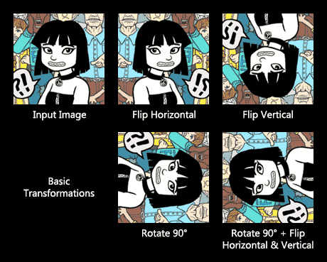
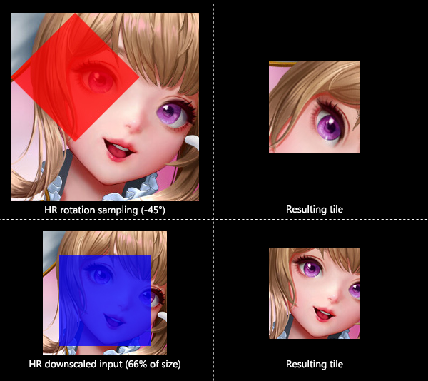
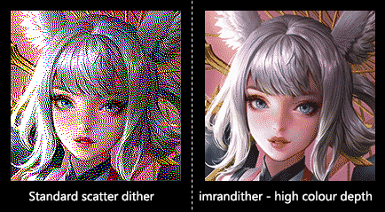
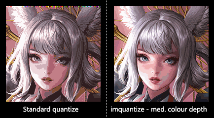
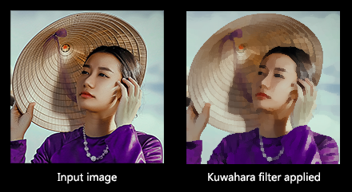

# BasicSR (Enhanced)

This is a fork of victorca25's [BasicSR](https://github.com/victorca25/BasicSR/) branch. Most of the documentation is there if you need any information regarding BasicSR. This readme will focus specifically on the differences of this fork.

## Table of Contents
1. [Dependencies](#dependencies)
2. [Features](#features)
3. [To Do](#todo)

### Dependencies

- All [BasicSR dependencies](https://github.com/victorca25/BasicSR/) as documented at victorca25's branch.
- [ImageMagick](https://imagemagick.org/script/download.php) for the image manipulation library. 
- Python package: [`pip install wand`](https://pypi.org/project/Wand/), to access IM from Python.

## Features
These features are configured in the training `.json` file. Because of the nature of the changes, set training mode to `LRHROTF` beforehand. Using any other modes will behave as the original branch. 

### Load state via CPU
- Lower end graphics card with low VRAM may have difficulty resuming from a state. If you get a out of memory error when continuing a training session, then set `"load2CPU":true` so that it is loaded to the system RAM instead.

### Image transformation
- Random flipping, 90 degree rotate and HR rotate are all independent from each other, and can be applied together.

### Revamped HR transform workflow
Currently only usable with `LRHROTF` mode with either only HR datasets defined, or same-scale datasets.
- When training with no LR data sources set, transformations are done only on the HR tile and LR tile are only generated at the last step. 
- If `hr_downscale": true` is set, large dataset images are randomly downscaled before cropping to the training tile size. This also applies to the LR dataset if same-scale training is used.
- If dataset image is smaller than training tile size, then it is automatically padded to the proper size with a random colour. This is different from original branch which scales the tile up, thus potentially compromising image quality.
- If `"hr_rrot": true` is set, a different image rotate function is used which does not scale up the result. This function is used in conjunction with cropping, so the image tile is built directly from the dataset image.

- Since the tile cropping happens at the same time as rotation, and will be applied to a downscaled input image if HR downscale is used as well. If all transformations are used in tandem, the results in a highly robust model with a low possibility of over-fitting. The downside is takes longer for the model to take shape.

### New LR noises
- `imdither` uses Imagemagick's dither engine to create more colour-accurate ordered dithering. Unlike the default ordered `dither` noise, this produces more random varying levels of colour depth that may help represent the original image colours more accurately. A noticeable trend when using `dither` to train models was that the colour contrast slowly declined over time, which is due to the extreme colours in the generated image being mapped to less vibrant colours. Even when using low colour depth, `imdither` has slightly better colour assignment.
  This approach emulates how the Fatality model's undithering training is done. As a bonus, it requires less processing time than the normal dithering method. *By default, the higher colour depth is clamped out. You can reenable it by increasing the colour depth in `scripts/augmentations.py` if required.*

- `imrandither` uses Imagemagick's dither engine to create mapped scattered dithering. Main difference between the implemention in the original `dither` noise is that it allows for higher colour depth, and adds Riemersma dither apart from Floyd-Steinberg. Care must be taken place when enabling this noise because the result may be almost similar to how some pixel art portray detail. Use only if you need extra denoising & blending strength.

- `imquantize` is similar to the standard `quantize` noise, except has better colour accuracy at higher colour depths.

- `kuwahara` uses Imagemagick's [Kuwahara filter](https://en.wikipedia.org/wiki/Kuwahara_filter) that basically removes all details from the image and only maintains the general shape. This theoretically helps to train inpainting, though it is recommended to be used only in short periods since normally the validation phase will act against this.

### New LR downscale types
- `123` will use Imagemagick's RGB scale, which supposedly maintains contrast when downscaling.
- `420` will use Imagemagick's liquid scale, which in theory has no use whatsoever. However in practice, it forces the model to keep certain details while blurring out all other. Use only if one needs to get high.

## To Do list:
- Adapt HR-only mode workflow to LRHR training where LR image size is identical to HR image size

## Additional Help 

If you have any questions, we have a [discord server](https://discord.gg/cpAUpDK) where you can ask them and a [Wiki](https://upscale.wiki) with more information.

---

## Acknowledgement
- Big thanks to *victorca25* for encouraging the creation of this fork.
- Thanks to *Twittman* for sharing how Fatality's training tiles were generated.
- Code architecture is inspired by [pytorch-cyclegan](https://github.com/junyanz/pytorch-CycleGAN-and-pix2pix).
- Thanks to *Wai Ho Kwok*, who contributes to the initial version.

### BibTex

    @InProceedings{wang2018esrgan,
        author = {Wang, Xintao and Yu, Ke and Wu, Shixiang and Gu, Jinjin and Liu, Yihao and Dong, Chao and Qiao, Yu and Loy, Chen Change},
        title = {ESRGAN: Enhanced super-resolution generative adversarial networks},
        booktitle = {The European Conference on Computer Vision Workshops (ECCVW)},
        month = {September},
        year = {2018}
    }
    @InProceedings{wang2018sftgan,
        author = {Wang, Xintao and Yu, Ke and Dong, Chao and Loy, Chen Change},
        title = {Recovering realistic texture in image super-resolution by deep spatial feature transform},
        booktitle = {The IEEE Conference on Computer Vision and Pattern Recognition (CVPR)},
        month = {June},
        year = {2018}
    }
    @article{Hui-PPON-2019,
        title={Progressive Perception-Oriented Network for Single Image Super-Resolution},
        author={Hui, Zheng and Li, Jie and Gao, Xinbo and Wang, Xiumei},
        booktitle={arXiv:1907.10399v1},
        year={2019}
    }
    @InProceedings{Liu2019abpn,
        author = {Liu, Zhi-Song and Wang, Li-Wen and Li, Chu-Tak and Siu, Wan-Chi},
        title = {Image Super-Resolution via Attention based Back Projection Networks},
        booktitle = {IEEE International Conference on Computer Vision Workshop(ICCVW)},
        month = {October},
        year = {2019}
    }