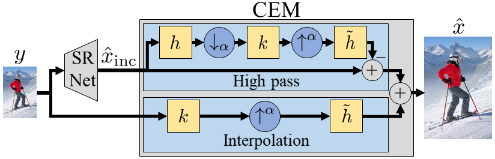

# Consistency Enforcing Module (CEM)

An architectural module that can enforce outputs consistency on **any given super-resolution (SR) model (pre-trained or not)**. If used during training, it can encourage consistency directly on the LR domain, instead of more traditional reconstruction losses that do so only indirectly on the HR domain with the SR image.

Wrapping a model with this module guarantees that its outputs would match the low-resolution inputs, when downsampled using a given downsampling kernel. The bicubic kernel is used by default.

   

Here, the lower branch of CEM perfoms an interpolation to determine the low-frequency content of the output from the LR image, while the upper branch is similar to a high-pass filter of the output of the network.
